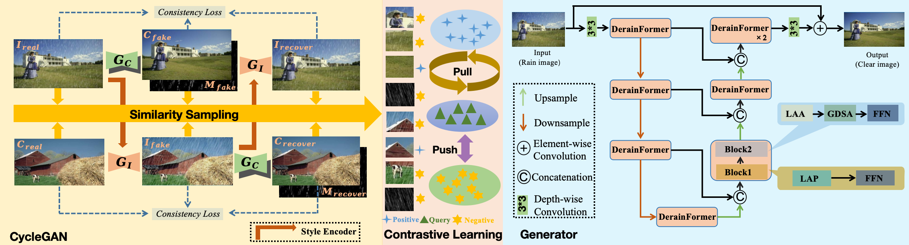
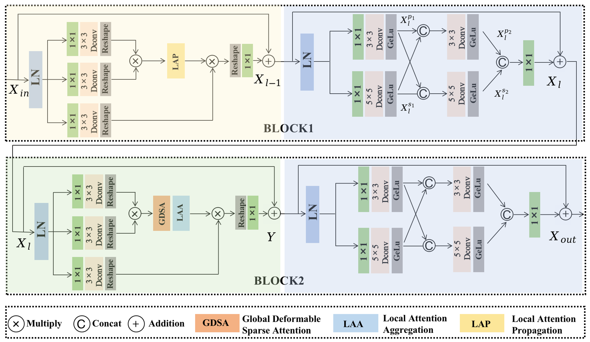

# CycFormer: Unsupervised Rain Removal Network Based on CycleGAN and Transformer

### Abstract
Rainy weather presents significant challenges for applications relying on visual perception in intelligent vehicles. The scarcity of real paired training data complicates single-image rain removal tasks, prompting an increasing  interest in unsupervised methods capable of handling real-world rainy-day images without paired data. Currently, most unsupervised rain removal approaches leverage the CycleGAN framework. However, Transformer models often struggle to effectively model real rain features owing to  their globally non-uniform distributions, limiting their integration within the CycleGAN for optimal performance in unsupervised tasks. This study introduces an unsupervised rain removal network combining CycleGAN with a DerainFormer Transformer. We first develop a deformable sparse attention mechanism to enhance the adaptability of the Transformer  for unsupervised tasks within the CycleGAN architecture. Additionally, we propose a two-stage alternating Transformer structure to better model the globally non-uniform characteristics of real rainwater in images. Furthermore, treating rain removal as a decomposition task, we propose an unsupervised rain layer training method using joint position contrastive learning to effectively separate rain patterns. Experimental validation on diverse real and synthetic rainwater datasets demonstrates the efficacy of the proposed unsupervised rain removal approach. 

### Contributions
1) In order to make the network extract rich global features of raindrops, this study designs the Transformer Attention Layer Feature Fusion Module on the network structure, which is the first time that the raindrop features extracted from multiple Transformer Attention Layers are fused for the first time in the de-raindrop task, so as to make the network more adaptable to the globally complex raindrop features.
2) In order to make UNet with global-local modeling capability, this study proposes for the first time a transition module between the up- and down-sampling operations, which is obtained by feature fusion of global and local information extractors, and which performs global-local modeling of feature information extracted from the down-sampling operations to help the network perform reconstruction tasks to enhance the detail recovery capability to mitigate artifacts.
3) In order to make the Transformer have the ability of adaptive processing of raindrops, different from the previous Transformer, this study improves the attention mechanism and the feedforward network from the global and local perspectives, respectively. Firstly, the uncertainty-based sparse attention mechanism is proposed to make the network model the global space more efficiently, and further localization is introduced in the three-channel feature information modeling on the feed-forward network for the characteristics of the raindrop image. The Transformer has an extremely comprehensive raindrop feature modeling capability, which can be well adapted to UNet to improve the rain removal performance.

### Video de-rain demo
Click on the “derain.mp4” file on the homepage or click https://github.com/derainsipl/CycFormer/blob/main/derain.mp4.

### Code
The code for this program will be published soon.
